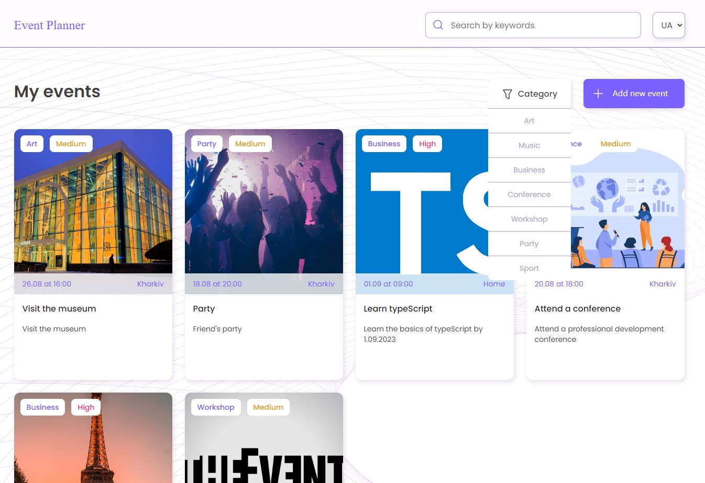

# Веб-додаток - Event planner

## Підготовка

1. Склонуй репозиторій командою `git clone https://github.com/dimadimaya/event-planner`
2. Переконайтеся, що на комп'ютері встановлено LTS-версію Node.js.
   [Скачай та встанови](https://nodejs.org/en/) її якщо необхідно.
3. Встанови базові залежності проекту командою `npm install`.
4. Для запуску, виконай команду `npm start`.
5. Перейди у браузері за адресою [http://localhost:3000/event-planner](http://localhost:3000/event-planner)

## Для створення Веб-додатку використовувалися:

1. [Create React App](https://github.com/facebook/create-react-app).
2. [Redux Toolkit](https://redux-toolkit.js.org/introduction/getting-started)
3. [Redux Persist](https://www.npmjs.com/package/redux-persist#basic-usage)
4. [React router dom](https://reactrouter.com/en/main/start/tutorial)
5. [React paginate](https://github.com/AdeleD/react-paginate)
6. [Cloudinary](https://cloudinary.com/)

## Основний функціонал додатку:

1. Головна сторінка, на якій користувачі можуть переглядати список найближчих
   подій. Також є можливість фільтрування подій за категоріями (наприклад, музика, спорт, культура тощо).
   Події з різним пріоритетом відображаються різними кольорами (зроблена позначка пріоритету в картці).
   Пошук події - є можливість шукати подію за назвою,
   скориставшись інпутом в хедері. Пошук відбувається посимвольно.
2. Сторінка створення події, на якій користувачі можуть заповнити форму з
   необхідною інформацією про подію, таку як назва, дата, час, місце, опис тощо.
3. Сторінка події, на якій відображається детальна інформація про конкретну подію.
4. Сторінка редагування події, на якій користувачі можуть редагувати заповнену
   форму з інформацією про подію, таку як назва, дата, час, місце, опис тощо.
5. Пагінація на головній сторінці.

# Web application - Event planner

## Preparation

1. Clone the repository with the command `git clone https://github.com/dimadimaya/event-planner`
2. Make sure you have the LTS version of Node.js installed on your computer.
   [Download and install](https://nodejs.org/en/) her if necessary.
3. Set the basic dependencies of the project as a command `npm install`.
4. To start, execute the command `npm start`.
5. Go to the address in the browser [http://localhost:3000/event-planner](http://localhost:3000/event-planner)

## To create the Web application, the following were used:

1. [Create React App](https://github.com/facebook/create-react-app).
2. [Redux Toolkit](https://redux-toolkit.js.org/introduction/getting-started)
3. [Redux Persist](https://www.npmjs.com/package/redux-persist#basic-usage)
4. [React router dom](https://reactrouter.com/en/main/start/tutorial)
5. [React paginate](https://github.com/AdeleD/react-paginate)
6. [Cloudinary](https://cloudinary.com/)

## The main functionality of the application:

1. The main page where users can view a list of nearby people
   events There is also an option to filter events by category (for example, music, sports, culture, etc.).
   Events with different priorities are displayed in different colors (the priority is marked in the card).
   Event search - it is possible to search for an event by name,
   using the input in the header. The search is character-by-character.
2. Event creation page where users can fill out a form with
   necessary information about the event, such as name, date, time, place, description, etc.
3. An event page that displays detailed information about a specific event.
4. Event edit page where users can edit the filled
   a form with event information such as name, date, time, location, description, etc.
5. Pagination on the main page.
